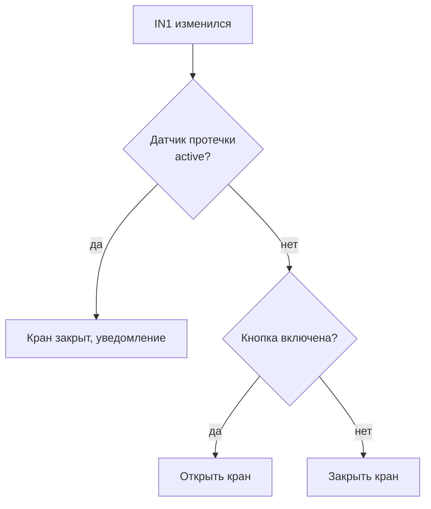
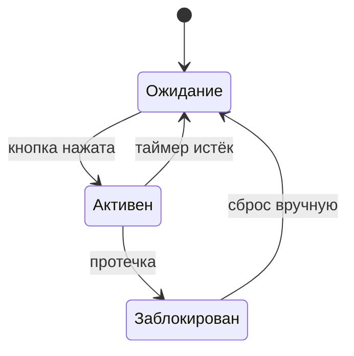
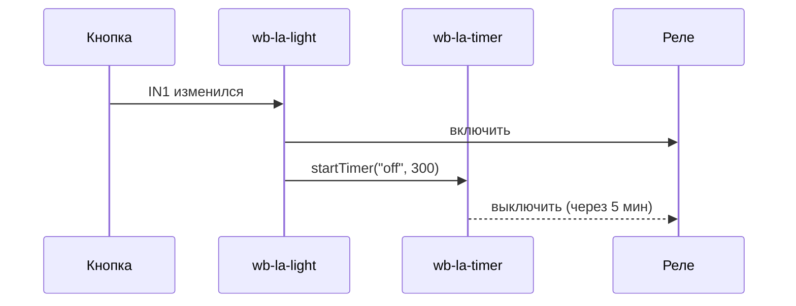

# Диаграммы и визуализация

Используй Mermaid-диаграммы чтобы показать **как работает** автоматизация до написания кода.

## Когда использовать

Два режима:

- **Design** (проектирование нового правила): таблица каналов → диаграмма → таблица конфликтов → вопрос «такое поведение?» → ждать подтверждение → код. Цель — выявить ошибки до написания.
- **Reverse-engineering** (анализ существующего правила): загрузить через `wbrules/Editor/Load`, разобрать → таблица каналов → диаграмма поведения. Цель — понять, что делает код. Шаг «дождись подтверждения, потом пиши код» здесь не применим.

Триггеры:

- **Перед написанием правила** — покажи логику до кода (design).
- **При конфликте правил** — покажи, какое правило «победит» (любой режим).
- **Для объяснения состояний** — переходы между режимами.
- **Для цепочек событий** — одно правило → MQTT → другое правило.
- **При вопросе «что делает это правило?»** — reverse-engineering, диаграмма за пользователем не запрашивается, она часть ответа.

## Выбор типа

| Ситуация | Тип |
|---|---|
| Переходы между состояниями, флаги, режимы | `stateDiagram-v2` |
| Логика «если X то Y» с ветками (один шаг обработки) | `flowchart TD` |
| Взаимодействие нескольких правил/устройств | `sequenceDiagram` |
| Простая таблица состояний (2-4 строки), гистерезис | Markdown-таблица |
| Гистерезис / sticky-логика (правило с памятью внутри dead zone) | `stateDiagram-v2` + Markdown-таблица: state показывает hold-состояния, таблица — границы |
| `xychart-beta` / графики данных | см. скилл `/history` (рендер истории) |

Для одного правила **может потребоваться несколько диаграмм** (например, flowchart обработчика + state переходов). Это норма — не пытайся уместить всё в одну.

## Примеры

### Логика правила (flowchart)



В Mermaid перенос строки внутри узла — `<br/>`, **не** `\n` (последний рендерится как литеральный текст).

### Переходы состояний (stateDiagram)



### Взаимодействие правил (sequenceDiagram)



### Таблица каналов (всегда первой, для design и reverse-engineering)

```
Канал                       | Тип             | Чтение                     | Запись               | Назначение
────────────────────────────────────────────────────────────────────────────────────────────────────────
hwmon/CPU Temperature       | float (°C)      | whenChanged + dev[]        | —                    | Температура CPU
wb-mr3_3/K1                 | switch (bool)   | —                          | dev[] = true/false   | Реле охлаждения
wb-msw-v4_20/Input 1        | pushbutton      | whenChanged                | —                    | Кнопка пользователя
```

Чтение/запись — глаголами; для каждого канала указан тип (см. wb-rules SKILL.md), и конкретно — `whenChanged`-триггер ли это, или просто читается через `dev[]` внутри `then`.

### Таблица конфликтов

```
Вход A        | Датчик B    | Правило 1   | Правило 2   | Результат
──────────────────────────────────────────────────────────────────────
OFF → ON      | inactive    | реле вкл    | —           | реле вкл ✓
OFF → ON      | active      | реле вкл    | реле выкл   | КОНФЛИКТ ✗
ON → OFF      | active      | реле выкл   | реле выкл   | реле выкл ✓
```

## Формат ответа при проектировании правила

1. **Таблица каналов** — что читает, что пишет, тип
2. **Диаграмма или таблица состояний** — логика
3. **Таблица конфликтов** — если есть существующие правила на тех же каналах
4. Вопрос «такое поведение?» — дождись подтверждения, потом пиши код
