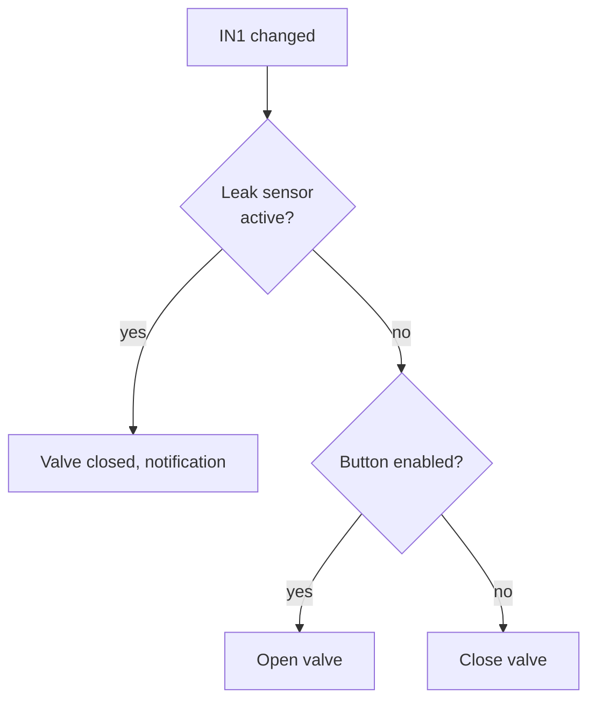
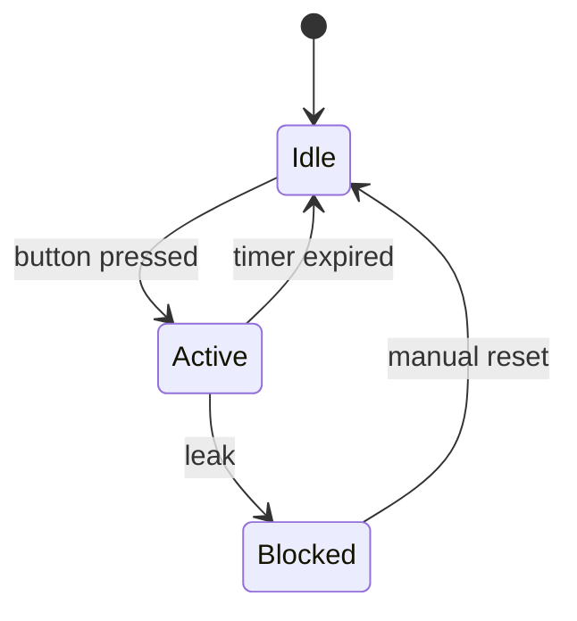
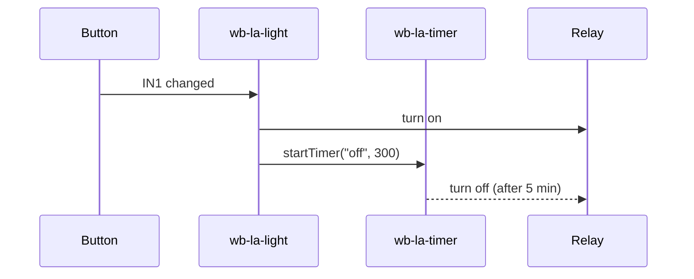

# Diagrams and visualization

Use Mermaid diagrams to show **how** automation works before writing code.

## When to use

Two modes:

- **Design** (designing a new rule): channel table → diagram → conflict table → "is this the desired behavior?" question → wait for confirmation → code. Goal: surface mistakes before writing.
- **Reverse-engineering** (analyzing an existing rule): load via `wbrules/Editor/Load`, dissect → channel table → behavior diagram. Goal: understand what the code does. The "wait for confirmation, then write code" step does not apply here.

Triggers:

- **Before writing a rule** — show the logic before code (design).
- **On rule conflict** — show which rule "wins" (either mode).
- **To explain states** — transitions between modes.
- **For event chains** — one rule → MQTT → another rule.
- **When asked "what does this rule do?"** — reverse-engineering, the diagram isn't requested by the user, it's part of the answer.

## Picking the type

| Situation | Type |
|---|---|
| Transitions between states, flags, modes | `stateDiagram-v2` |
| "If X then Y" logic with branches (single processing step) | `flowchart TD` |
| Interaction of multiple rules/devices | `sequenceDiagram` |
| Simple state table (2-4 rows), hysteresis | Markdown table |
| Hysteresis / sticky logic (rule with memory inside dead zone) | `stateDiagram-v2` + Markdown table: state shows hold states, table shows boundaries |
| `xychart-beta` / data charts | see `/history` skill (rendering history) |

For one rule **multiple diagrams may be needed** (e.g. handler flowchart + state transitions). That's fine — don't try to cram everything into one.

## Examples

### Rule logic (flowchart)



In Mermaid, line break inside a node is `<br/>`, **not** `\n` (the latter renders as literal text).

### State transitions (stateDiagram)



### Rule interaction (sequenceDiagram)



### Channel table (always first, for both design and reverse-engineering)

```
Channel                     | Type            | Read                       | Write                | Purpose
────────────────────────────────────────────────────────────────────────────────────────────────────────
hwmon/CPU Temperature       | float (°C)      | whenChanged + dev[]        | —                    | CPU temperature
wb-mr3_3/K1                 | switch (bool)   | —                          | dev[] = true/false   | Cooling relay
wb-msw-v4_20/Input 1        | pushbutton      | whenChanged                | —                    | User button
```

Read/write — as verbs; for each channel specify the type (see wb-rules SKILL.md), and specifically — whether it's a `whenChanged` trigger or just read via `dev[]` inside `then`.

### Conflict table

```
Input A       | Sensor B    | Rule 1      | Rule 2      | Result
──────────────────────────────────────────────────────────────────────
OFF → ON      | inactive    | relay on    | —           | relay on ✓
OFF → ON      | active      | relay on    | relay off   | CONFLICT ✗
ON → OFF      | active      | relay off   | relay off   | relay off ✓
```

## Response format when designing a rule

1. **Channel table** — what is read, what is written, type
2. **Diagram or state table** — logic
3. **Conflict table** — if existing rules use the same channels
4. "Is this the desired behavior?" question — wait for confirmation, then write code
